# KuRoyale Full Logical Architecture (UML)

This file contains the Mermaid UML diagram for the KuRoyale project. You can copy the code block below and paste it into [Mermaid Live Editor](https://mermaid.live/) to generate a high-resolution image.

## UML Class Diagram

```mermaid
classDiagram
    %% ==================================================
    %% 1. SYSTEM INTERFACES
    %% ==================================================
    class IBattleState {
        <<interface>>
        +getArena() Arena
        +getActiveTroops() List~Troop~
        +getActiveBuildings() List~Building~
        +getProjectiles() List~Projectile~
        +addProjectile(Projectile p)
        +getCardByName(String name) Card
    }

    class ICombatant {
        <<interface>>
        +isAlive() boolean
        +isPlayerSide() boolean
        +isAirUnit() boolean
        +getPosition() GridPosition
        +getWorldPosition() Vector2
        +getRange() double
        +getDamage() int
        +takeDamage(int amount)
        +stun(double duration)
    }

    %% ==================================================
    %% 2. CORE GAME STATE (MODEL)
    %% ==================================================
    class AbstractGameState {
        <<abstract>>
        #Arena arena
        #List~Troop~ activeTroops
        #List~Building~ activeBuildings
        #TroopMovementService troopMovementService
        #CombatService combatService
        +updateEntities(double dt)
        +handleCombat(double dt)
        #spawnUnit(boolean isPlayer, Card card, int x, int y)
    }

    class GameState {
        -Hand playerHand
        -ElixirManager playerElixir
        -ElixirManager botElixir
        -BotLogic bot
        +update(double dt)
        +placeCard(boolean isPlayer, int index, int x, int y)
    }

    class PvPGameState {
        -Hand player1Hand
        -Hand player2Hand
        -ElixirManager p1Elixir
        -ElixirManager p2Elixir
        +syncState(NetworkGameStateSnapshot snapshot)
    }

    %% ==================================================
    %% 3. DOMAIN ENTITIES
    %% ==================================================
    class Troop {
        -UnitState state
        -Card baseCard
        -CombatStats stats
        +update(double dt)
    }

    class Building {
        -double remainingLifetime
        -int width
        -int height
        +isAlive() boolean
    }

    class Tower {
        -TowerType type
        -boolean isPlayerSide
        +isKingTower() boolean
    }

    class Projectile {
        -Vector2 position
        -Vector2 target
        -double speed
        +update(double dt)
    }

    class Card {
        -String name
        -int cost
        -CardType type
        -int hp
        -int damage
    }

    %% ==================================================
    %% 4. ARENA & SPATIAL SYSTEMS
    %% ==================================================
    class Arena {
        -GridCell[][] grid
        -SpatialGrid spatialGrid
        -List~Tower~ towers
        +getEntitiesInRange(Vector2 pos, double range)
        +removeDeadTowers()
    }

    class SpatialGrid {
        -Map buckets
        +add(ICombatant entity)
        +remove(ICombatant entity)
        +query(Vector2 pos, double radius)
    }

    %% ==================================================
    %% 5. LOGIC & SERVICES
    %% ==================================================
    class CombatService {
        +update(double dt, IBattleState state)
        +applyAreaDamage(IBattleState state, Vector2 pos, double radius, double damage)
    }

    class TroopMovementService {
        -PathfindingStrategy groundStrategy
        -PathfindingStrategy airStrategy
        +updateTroops(double dt, IBattleState state, List~Troop~ troops)
        -convertPathToVector2(Arena arena, Deque~GridPosition~ gridPath, boolean isAir) Deque~Vector2~
        -isLineWalkable(Arena arena, GridPosition p1, GridPosition p2, boolean isAir) boolean
    }

    class PathfindingStrategy {
        <<interface>>
        +computePath(Arena arena, Troop troop, GridPosition destination) Deque~GridPosition~
    }

    class GroundPathfindingStrategy {
        +computePath(Arena arena, Troop troop, GridPosition destination) Deque~GridPosition~
    }

    class AirDirectPathfindingStrategy {
        +computePath(Arena arena, Troop troop, GridPosition destination) Deque~GridPosition~
    }

    class TargetingService {
        +findNearestTarget(ICombatant seeker, IBattleState state)
    }

    class ElixirManager {
        -double currentElixir
        -boolean isDoubleElixir
        +update(double dt)
        +spend(int amount)
    }

    %% ==================================================
    %% 6. RELATIONSHIPS
    %% ==================================================
    
    %% Implementation
    IBattleState <|.. AbstractGameState
    AbstractGameState <|-- GameState
    AbstractGameState <|-- PvPGameState
    
    ICombatant <|.. Troop
    ICombatant <|.. Building
    ICombatant <|.. Tower

    %% Composition
    AbstractGameState *-- Arena
    AbstractGameState *-- CombatService
    AbstractGameState *-- TroopMovementService
    
    Arena *-- SpatialGrid
    Arena *-- Tower
    
    GameState *-- ElixirManager
    GameState *-- Hand
    
    %% Dependencies
    Troop o-- Card
    Building o-- Card
    Troop ..> TargetingService
    CombatService ..> Projectile
    TroopMovementService ..> TargetingService
```

